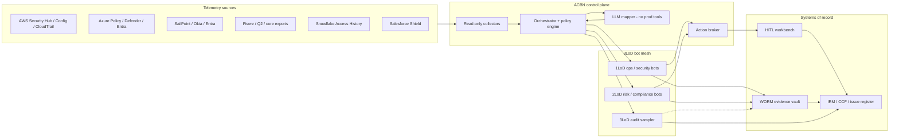
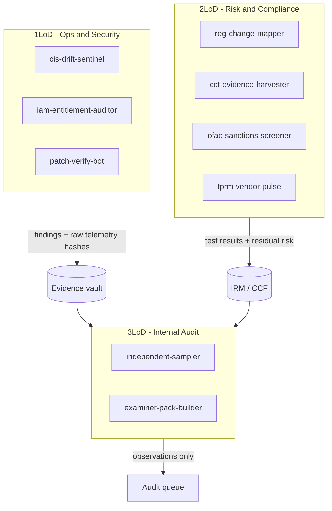
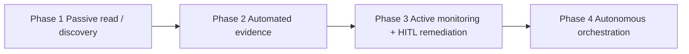

# Autonomous Cybersecurity Bot Network (ACBN)

**Audience:** CTO, CISO, CRO, CAE, 2LoD risk, Internal Audit  
**Operating model:** Three Lines of Defense (3LoD)  
**Scope:** US financial institutions and other regulated enterprises  
**Design principle:** Bots audit via technical telemetry and automated control configurations — not via static checklists. High-impact actions remain Human-in-the-Loop (HITL) until an explicit autonomy grant.

This specification is asset-agnostic. Incomplete CMDBs, missing tags, and legacy cores are expected inputs, not blockers.

---

## 0. Design thesis

| Driver | Implication for ACBN |
| --- | --- |
| Vanta-class continuous compliance | Evidence is harvested from live control configurations on a clock, not from screenshot campaigns. |
| ServiceNow GRC/IRM | Issues, risks, and controls are objects with owners, SLA, and CMDB linkage. Bots write to those objects; they do not own the system of record. |
| Compliance.AI-class reg change | Legislative and handbook feeds are parsed into impact tickets mapped to the Common Control Framework (CCF). |
| Incomplete data governance | Discovery never fail-stops a *read* workflow. *Write / remediate* fail-closes when confidence or ownership is below threshold. |
| LLM-assisted mapping | Models summarize and map. They do not execute production changes. Tool use is brokered through an allowlisted action plane. |



---

## Section 1 — Bot architecture and governance (3LoD taxonomy)

### 1.1 Trust boundaries

| Boundary | What may cross | What may not |
| --- | --- | --- |
| **B0 Collector** | Read APIs, log subscriptions, S3/Blob exports, file-drop from cores | Any mutating API, except idempotent `Describe*` / `Get*` |
| **B1 Orchestrator** | Task JSON, policy decisions, bot heartbeats | Raw customer NPI in LLM prompts; long-lived cloud admin keys |
| **B2 Action broker** | Allowlisted actions with ticket ID + approver | Direct `iam:Put*`, firewall changes, core-banking writes without HITL token |
| **B3 Evidence vault** | Hash-chained artefacts, control IDs, collector IDs | Overwrite or delete (WORM / object-lock) |
| **B4 LLM mapper** | De-identified control text, handbook excerpts, mapping hypotheses | Tool credentials, live session tokens, unredacted NPI/CHD |
| **B5 3LoD replica** | Read replica of vault + IRM | Triggering remediations or closing 1LoD/2LoD issues |

Service accounts are per-bot, per-environment, scoped to least privilege, rotated via PAM (e.g. Delinea / cloud secrets), and tagged `acbn:line`, `acbn:bot_id`, `acbn:env`. Cross-line impersonation is denied at the broker.

### 1.2 RBAC and 3LoD personas

| Line | Human roles | Bot personas | Write scope |
| --- | --- | --- | --- |
| **1LoD** | SOC, IAM, cloud ops, platform engineering | Telemetry ingest, CIS drift, IAM recertification, patch verification, SaaS config drift | Tickets in ITSM; optional auto-remediate *only* on allowlisted low-blast controls after Phase 4 grant |
| **2LoD** | Cyber risk, compliance, BSA/AML, privacy | CCF mapping, CCT, vendor pulse, OFAC/sanctions, regulatory change impact | Risk register, control test results, policy-gap issues. Never production IAM or network. |
| **3LoD** | Internal audit, examiner liaison | Independent sampler, evidence packager, trail integrity verifier | Read-only. May open *audit observations* in a segregated IRM queue. Cannot close 1LoD/2LoD items. |

Separation of duties (SOX ITGC): the identity that *collects* evidence cannot *attest* the control; the identity that *attests* cannot *remediate*; 3LoD service principals have `deny` on all action-broker verbs.

### 1.3 Non-repudiable logging

Every bot task emits a canonical event to an append-only log (CloudTrail-equivalent + vault sidecar):

```json
{
  "event_id": "01JQR7K3N8M2",
  "ts": "2026-09-09T23:00:00Z",
  "bot_id": "iam-entitlement-auditor",
  "collector_id": "iam-entitlement-auditor",
  "line": "1LOD",
  "task_id": "task-8841",
  "actor_principal": "arn:aws:iam::222233334444:role/acbn-iam-auditor",
  "trigger": { "type": "cron", "cron": "0 6 * * 1" },
  "inputs_hash": "sha256:9f2c...",
  "policy_version": "ccf-2026.09.1",
  "controls": ["CCF-AC-001", "CCF-AC-006"],
  "control_ids": ["CCF-AC-001", "CCF-AC-006"],
  "env": "prod/synthetic",
  "decision": "HITL_REQUIRED",
  "outputs": ["vault://evidence/8841/iam-recert.json"],
  "prev_event_hash": "sha256:41aa..."
}
```

Hash-chain `prev_event_hash` so 3LoD can detect truncation. `event_hash` is the digest of the event **excluding** `event_hash` itself. Logs are SIEM-forwarded (immutable index) and retained to the stricter of SOX, GLBA, PCI DSS 12.10.1, or examiner request. Vault payloads must not contain unredacted NPI/CHD.

### 1.4 HITL gates (high-impact actions)

HITL is mandatory when any of the following is true:

1. Action mutates identity, network, or core-banking entitlements.
2. Asset `registration_state != registered` or `owner_confidence < 0.80`.
3. Control is SOX-in-scope ITGC or PCI DSS CDE-adjacent.
4. OFAC/sanctions hit, or true-positive confidence is below the 2LoD threshold.
5. LLM mapping confidence `< 0.70` (mapping may proceed as *draft*; cannot auto-close a gap).
6. Blast radius `> N` identities or `> 1` production account.

Approval token schema: `approver_id`, `sod_peer_id` (for dual control), `expires_at`, `bound_task_id`, `action`, `asset_or_principal`. The broker rejects tokens reused across tasks.

### 1.5 Persona map (operations)



---

## Section 2 — Automated GRC bot catalog

Shared task definition (orchestrator ingress):

```json
{
  "$schema": "https://acbn.local/schemas/bot-task.v1.json",
  "task_id": "task-8841",
  "bot_id": "iam-entitlement-auditor",
  "line": "1LOD",
  "priority": "P2",
  "trigger": { "type": "cron", "cron": "0 6 * * 1" },
  "scope": {
    "env": ["prod", "dr"],
    "platforms": ["aws", "azure", "snowflake", "salesforce", "q2"],
    "include_unregistered": true
  },
  "ingestion": [
    { "system": "aws", "endpoint": "iam.amazonaws.com", "api": "GenerateServiceLastAccessedDetails" },
    { "system": "snowflake", "endpoint": "SNOWFLAKE.ACCOUNT_USAGE.ACCESS_HISTORY" }
  ],
  "controls": ["NIST.AC-2", "NIST.AC-6", "SOX.ITGC.A.2", "FFIEC.IS.II.C"],
  "hitl": { "required": true, "reasons": ["mutates_identity=false", "sox_in_scope=true"] },
  "fallback": { "on_missing_cmdb": "enrich_and_quarantine_class", "min_confidence": 0.55 }
}
```

Pseudo-code for the orchestrator loop:

```
for task in due(tasks):
  assets = discover(task.scope)                  # never throws on missing CMDB
  classified = enrich(assets)                    # metadata, owner, data class
  evidence = bot.execute(task, classified)         # read path
  vault.put(evidence, hash_chain=True)
  if task.requires_action:
    if hitl_required(task, classified):
      broker.queue(HITL, evidence)
    elif autonomy_granted(task) and classified.all_registered:
      broker.execute(allowlist[task.bot_id], evidence)
    else:
      irm.open_issue(evidence, state="exception")
  emit_log(task, evidence)
```

### 2.1 Catalog overview

| Bot ID | Line | Inspiration | Primary job |
| --- | --- | --- | --- |
| `cis-drift-sentinel` | 1LoD | Vanta continuous monitoring + CIS Benchmarks | Detect configuration drift vs CIS / CIS-mapped 800-53 |
| `iam-entitlement-auditor` | 1LoD | ServiceNow CMDB + IAM | Least privilege, orphaned accounts, SoD clashes |
| `patch-verify-bot` | 1LoD | Vanta + vuln scanners | Verify patch state against telemetry, not tickets |
| `reg-change-mapper` | 2LoD | Compliance.AI | Parse FFIEC/FINRA/FDIC/OFAC feeds → CCF impact |
| `cct-evidence-harvester` | 2LoD | ServiceNow CCT + Vanta evidence | Continuous control tests + artefact packaging |
| `ofac-sanctions-screener` | 2LoD | OFAC / BSA | Screen vendors, privileged identities, outbound dests |
| `independent-sampler` | 3LoD | Internal audit | Read-only statistical sample + examiner pack |

Detailed specs for six core bots follow. `tprm-vendor-pulse` is specified as an extension of `cct-evidence-harvester` (same evidence contract, vendor questionnaire + SIG/CAIQ + continuous scan).

---

### Bot 1 — `cis-drift-sentinel` (1LoD)

| Field | Spec |
| --- | --- |
| **Trigger & frequency** | CloudTrail / Azure Activity continuous stream; full CIS benchmark sweep daily 02:00 local; on-demand after landing-zone change. |
| **Ingestion** | AWS Config + Security Hub CIS/FSBP; Azure Policy / Defender for Cloud; Snowflake `SHOW PARAMETERS`; Salesforce org-wide defaults & Shield; for Fiserv/Q2: hardened-image attestations + Jump-host CIS reports + SSO session telemetry when vendor APIs are absent. |
| **Control mapping** | CIS Benchmarks (AWS/Azure/Snowflake); NIST SP 800-53 Rev. 5 `CM-2`, `CM-6`, `CM-8`; NIST CSF 2.0 `PR.PS-01`, `ID.AM-01`; FFIEC Information Security Handbook (configuration management); PCI DSS 2.2, 12.3; SOX ITGC change/config. |
| **Execution logic** | 1) Pull current resource config. 2) Diff against signed baseline bundle (`baseline_id` + CIS version). 3) Score drift: `info / low / medium / high / critical` by data-class and prod flag. 4) Write evidence JSON + CIS rule IDs. 5) Open IRM issue only if drift persists > SLA (default 24h prod). |
| **Evidence artefact** | `cis-result.v1.json` (rule, resource ARN/ID, expected, observed, collector_id, screenshot-optional *not required*), plus Config snapshot hash. |
| **Fallback** | Untagged resource: still tested; classified `unregistered`. If CIS profile unknown, apply **minimum viable baseline** (public-ACL deny, no 0.0.0.0/0 admin, encryption at rest unknown → `fail`). Never skip prod accounts because CMDB is empty. |

---

### Bot 2 — `iam-entitlement-auditor` (1LoD)

| Field | Spec |
| --- | --- |
| **Trigger & frequency** | Weekly recertification cron; event-driven on `CreateUser` / Entra app consent / Snowflake `GRANT`; joiner-mover-leaver from IGA (SailPoint) within 15 minutes. |
| **Ingestion** | AWS IAM Access Analyzer + last-accessed; Azure PIM / Entra sign-in logs; Snowflake `GRANTS_TO_USERS` + Access History; Salesforce PermissionSet assignments; Okta / SailPoint entitlements; Q2/Fiserv: SSO groups + privileged-terminal logs + vendor-provided user extracts (SFTP). |
| **Control mapping** | NIST `AC-2`, `AC-3`, `AC-6`, `IA-4`; CSF `PR.AA-01/05`; FFIEC IS access control & Architecture; SOX ITGC access (provision, recertify, terminate); PCI DSS 7.x, 8.x; GLBA Safeguards access. |
| **Execution logic** | Build entitlement graph: principal → permission → resource → data class. Flag: unused > 90 days, standing admin, SoD clash (developer + prod-deploy + change-approve), terminated HR ID still active. Propose revocation **diff**; do not apply in Phase 1–3. |
| **Evidence artefact** | Entitlement graph dump (parquet or JSONL), exception register, recert campaign file for manager HITL. |
| **Fallback** | Orphan principal with no HR match: `identity_state=orphaned`, owner=`security-ops-queue`, confidence 0.40. Continue audit. Do not auto-delete. Dark SaaS via SSO logs: register as `shadow_app`, feed TPRM bot. |

---

### Bot 3 — `patch-verify-bot` (1LoD)

| Field | Spec |
| --- | --- |
| **Trigger & frequency** | Daily; plus within 24h of vendor KEV / CISA KEV add. |
| **Ingestion** | Tenable / Qualys / Defender for Endpoint / Inspector; AWS SSM inventory; Azure Update Manager; container image SBOM (if present); core banking: vendor patch bulletins + change tickets when agentless. |
| **Control mapping** | NIST `SI-2`, `RA-5`; CSF `ID.RA-01`, `PR.PS-02`; FFIEC Operations; PCI DSS 6.3; SOX ITGC change. |
| **Execution logic** | Join vuln findings to asset inventory **including unregistered**. Treat “no agent” as `coverage_gap`, not as patched. KEV on CDE or GLBA NPI store = P1 issue regardless of CMDB. |
| **Evidence artefact** | Coverage matrix (in-scope assets × scanner last-seen), exception list, KEV delta. |
| **Fallback** | Missing CMDB OS field: infer from banner/SSM; if unknown, mark `unverifiable` and raise 2LoD coverage risk. Q2/Fiserv: accept signed vendor attestation + independent scan of *reachable* jump hosts. |

---

### Bot 4 — `reg-change-mapper` (2LoD)

| Field | Spec |
| --- | --- |
| **Trigger & frequency** | Continuous RSS/API for Federal Register, FFIEC handbook updates, FINRA notices, FDIC FIL, OFAC SDN; daily digest; human 2LoD review weekly. |
| **Ingestion** | Compliance.AI-class legislative feed *or* equivalent (Federal Register API, FFIEC, FinCEN, OFAC). Internal policy corpus in vault (versioned). CCF control library. |
| **Control mapping** | Output is a *proposed* map to NIST 800-53, CSF 2.0 GV/ID/PR, CRI Profile diagnostic statements, PCI DSS, GLBA, SOX ITGC. LLM drafts; 2LoD attests. |
| **Execution logic** | 1) Normalize feed item. 2) LLM extracts obligations (de-identified). 3) Diff vs CCF. 4) Impact score = (applicability × residual gap × time-to-enforcement). 5) Open `reg-change` issue with affected bots/controls. |
| **Evidence artefact** | `obligation.json` + source URL + hash of source PDF + mapping table + attestor field (empty until HITL). |
| **Fallback** | Unmapped regulation: create `ccf:UNMAPPED` stub, do not auto-assign owners. If feed parse fails, store raw blob and page 2LoD. |

---

### Bot 5 — `cct-evidence-harvester` (2LoD)

| Field | Spec |
| --- | --- |
| **Trigger & frequency** | Per-control cadence from CCF (daily / weekly / monthly / quarterly) matching SOX, PCI, and FFIEC exam cycles. |
| **Ingestion** | Consumes vault artefacts from 1LoD bots; ServiceNow/Workiva CCF; CMDB (best-effort); policy documents. |
| **Control mapping** | Each CCF item stores `framework_refs[]`. Example: `CCF-AC-001` → NIST AC-2, SOX ITGC A.2, FFIEC IS access, PCI 7.2. |
| **Execution logic** | Evaluate *test procedure* against telemetry (pass / fail / inconclusive). Inconclusive ≠ pass. Package evidence for the control period. Drive issue lifecycle: detect → assign → SLA → verify-fix (re-test) → close *only* with 1LoD owner + 2LoD reviewer (SoD). |
| **Evidence artefact** | `control-test-result.v1` + linked vault objects + population definition + sample method. |
| **Fallback** | Missing population (no CMDB): test against *discovered* set and label scope `discovered-not-authorized-inventory`. Examiners see coverage gap as a finding, not a silent skip. |

---

### Bot 6 — `independent-sampler` (3LoD)

| Field | Spec |
| --- | --- |
| **Trigger & frequency** | Monthly independent sample; pre-exam burst; never on 1LoD/2LoD schedule (separate calendar). |
| **Ingestion** | **Read replica** of vault and IRM only. No collector credentials. |
| **Control mapping** | Samples across SOX ITGC, FFIEC IS, PCI, GLBA Safeguards, CSF GV. Independent of 2LoD test plan. |
| **Execution logic** | Stratified random sample (e.g. 25 ITGC + 15 cyber + 10 vendor). Re-perform test from raw hashes. Compare 2LoD conclusion vs 3LoD re-performance. Exceptions → audit observation queue. |
| **Evidence artefact** | Examiner pack: workpapers, hash manifests, population, sample seed (reproducible), exception log. |
| **Fallback** | If vault object missing: observation `evidence-integrity-gap`. Never call 1LoD bots to “fill in” during the audit window (independence). |

---

### 2.2 Control-mapping matrix (illustrative CCF slice)

| CCF ID | NIST 800-53 Rev. 5 | NIST CSF 2.0 | FFIEC / CRI | PCI DSS v4.0 | SOX ITGC | GLBA / OFAC | Primary bots |
| --- | --- | --- | --- | --- | --- | --- | --- |
| CCF-AC-001 Account lifecycle | AC-2, IA-4 | PR.AA-01 | IS access control; CRI access mgmt | 7.2, 8.2 | Access provision / terminate | Safeguards access | iam-entitlement-auditor, cct-evidence-harvester |
| CCF-AC-006 Least privilege | AC-6 | PR.AA-05 | IS least privilege | 7.2.1 | Privileged access | — | iam-entitlement-auditor |
| CCF-CM-002 Secure baseline | CM-2, CM-6 | PR.PS-01 | IS config mgmt; Architecture | 2.2 | Change / config | — | cis-drift-sentinel |
| CCF-SI-002 Patch | SI-2, RA-5 | PR.PS-02 | Operations handbook | 6.3 | Change | — | patch-verify-bot |
| CCF-AU-003 Evidence integrity | AU-9, AU-10 | GV.AU | Audit handbook | 10.3 | Logging ITGC | — | independent-sampler |
| CCF-RM-001 Reg inventory | PM-30, PM-31 | GV.OC, GV.PO | Supervisory updates | 12.1 | — | OFAC program | reg-change-mapper |
| CCF-AM-001 Asset inventory | CM-8 | ID.AM-01 | Architecture | 12.5.1 | — | — | all 1LoD + discovery |
| CCF-SA-001 Sanctions | — | GV.RR | OFAC; BSA | — | — | OFAC SDN | ofac-sanctions-screener |
| CCF-SA-002 Vendor oversight | SA-9, SR-3 | GV.SC | CRI third party; FFIEC TPRM | 12.8 | Vendor ITGC | Vendor OFAC | tprm-vendor-pulse, cct |
| CCF-AI-001 LLM / bot misuse | SA-8, SI-4 (adapted) | GV.PO, PR.PS | IS emerging tech | 6.5 (as applicable) | Change (bot promote) | NPI handling | orchestrator policy; OWASP LLM controls |

OWASP Top 10 for LLM Applications is applied to the **mapper and any natural-language bot**, not as a substitute for 800-53: LLM01 prompt injection, LLM02 sensitive disclosure, LLM06 excessive agency, LLM07 system prompt leakage, LLM08 vector/rag poisoning.

---

## Section 3 — Adaptive data governance and asset handling

### 3.1 Discovery workflow (does not fail closed on missing CMDB)

```mermaid
sequenceDiagram
  participant C as Collector
  participant D as Discovery
  participant E as Enrichment
  participant Q as Classification
  participant V as Vault
  participant H as HITL
  C->>D: Enumerate cloud, IdP, network, core extracts
  D->>D: Match CMDB / IRM CI
  alt CI found and tags complete
    D->>Q: registration_state=registered
  else CI found, tags incomplete
    D->>E: Infer owner, env, data class
    E->>Q: registration_state=partial confidence
  else No CI
    D->>E: Create UnregisteredAsset
    E->>Q: registration_state=unregistered
  end
  Q->>V: Asset record + evidence of discovery
  alt Read / test workflow
    Q-->>C: Continue tests on all states
  else Mutating action AND confidence < 0.80
    Q->>H: Block broker; queue ownership
  end
```

**Step-by-step**

1. **Enumerate** from authoritative *technical* sources first: cloud resource APIs, IdP applications, certificate transparency / internal PKI, VPC flow / firewall objects, Snowflake accounts, Salesforce orgs, SFTP drops from Fiserv/Q2.
2. **Correlate** with CMDB (ServiceNow) and IGA. Matching keys: ARN, Azure resource ID, serial, hostname, AMI, certificate CN, account ID.
3. **Enrich** untagged objects: naming convention regex, subnet → env map, IAM principal tags, DLP/DSPM hits (Varonis-class) for data class, billing tags, Terraform state if readable.
4. **Classify** `registered | partial | unregistered | shadow`. Attach `owner_confidence` 0–1.
5. **Isolate (logical):** unregistered assets are labeled `acbn:quarantine-class=true`. This is a *governance* isolation (no auto-remediation, no LLM context that includes raw payloads). Network quarantine is a HITL 1LoD action, never autonomous in Phases 1–3.
6. **Promote:** when owner attests, CI is written *to* CMDB via HITL — bots do not silently invent production CIs without 1LoD confirmation.
7. **Re-test:** CCT bot includes unregistered population as a first-class coverage metric (`inventory_integrity`).

### 3.2 Security controls on the bot mesh

| Threat | Control |
| --- | --- |
| Prompt injection via ticker text, vuln titles, vendor answers | LLM isolated; untrusted text in *data* channel only; no tool side-effects from model output; instruction hierarchy in system prompt; allowlist broker ignores model-requested verbs not in task JSON. |
| Data exfiltration via bot | Collectors cannot reach public internet except approved APIs; vault buckets deny public ACL (CIS); DLP on broker egress; no copy of NPI into LLM prompts (tokenize / hash). |
| Rogue bot execution | Signed task bundles; orchestrator admits only bots with `cosign`-verified images; PAM-brokered credentials with 1h TTL; kill switch `ACBN_GLOBAL_HALT` in secrets manager; 3LoD cannot deploy bots. |
| Excessive agency (OWASP LLM06) | Models produce *hypotheses* (`mapping_draft`). Action broker requires `task.action_id` from policy engine, not from model JSON. |
| RAG poisoning | Policy corpus is signed and version-pinned; untrusted feeds stored separately; retrieval filter `corpus=signed-ccf`. |
| Credential theft | No API keys in bot source; cloud IAM roles + workload identity; Snowflake key-pair per bot; Salesforce JWT bearer confined to read reports. |
| Lateral movement | Per-bot SG / PE; 3LoD replica in separate account; no peering from 3LoD to production collectors. |

---

## Section 4 — CTO deployment roadmap and KPI framework

### 4.1 Phased implementation



| Phase | Autonomy | Bots live | Exit criteria (evidence, not slogans) |
| --- | --- | --- | --- |
| **1 — Passive read / discovery** | Collectors + discovery + vault only. Zero IRM writes except asset *candidates*. | cis-drift (report), iam-auditor (report), discovery | Inventory of discovered vs CMDB; collector coverage by platform; hash-chain logs verified by 3LoD sample. |
| **2 — Automated evidence** | CCT writes test results. Issues are *draft*. | + cct-evidence-harvester, reg-change-mapper (draft maps) | CCF subset (start with SOX ITGC + CIS prod) has current-period artefacts; inconclusive rate tracked. |
| **3 — HITL remediation** | Broker opens ITSM changes; dual control for prod IAM/network. | + patch-verify, ofac-screener, tprm | MTTA/MTTR on bot-opened issues; dual-control success rate; no unauthorized prod mutations (CloudTrail attest). |
| **4 — Autonomous orchestration** | Allowlisted low-blast remediations (e.g. disable unused IAM key unused 180d in *non-prod*, close public S3 ACL in sandbox). Prod still HITL unless CISO grant per-control. | Policy engine + canary | Written autonomy standard; kill-switch tested quarterly; MRM-style review of the *bot system* itself (conceptual soundness, drift, monitoring). |

Do not skip Phase 1. Autonomy is a *grant*, not a default.

### 4.2 Executive KPIs (definitions — measure, do not invent)

All percentages use **documented populations**. If the CMDB is incomplete, the denominator is `discovered_in_scope ∪ cmdb_in_scope` and coverage is reported as a range.

| KPI | Formula | Cadence | Owner |
| --- | --- | --- | --- |
| **Collector coverage** | `assets_with_fresh_telemetry / discovered_in_scope` | Weekly | 1LoD platform |
| **Inventory integrity** | `registered / discovered` and `unregistered_count` | Weekly | 1LoD + CMDB steward |
| **Hours returned to operators** | `Σ (manual_minutes_baseline − bot_minutes) / 60` using time-and-motion on a *sampled* control set, not a vendor slide | Quarterly | 2LoD with 1LoD |
| **Audit-readiness coverage** | `controls_with_complete_current_period_evidence / ccf_in_scope` | Monthly / exam | 2LoD |
| **Control test velocity** | `automated_tests_completed / period` and `inconclusive_rate` | Weekly | 2LoD |
| **Issue cycle time** | Detect → verify-fix (median, p90) | Monthly | 1LoD |
| **Residual risk (control-level)** | `inherent_score × (1 − effectiveness)` where effectiveness is last-n test pass rate *excluding* inconclusive | Quarterly | 2LoD |
| **Independence delta** | `3LoD_exceptions / 3LoD_sample` | Monthly | 3LoD / CAE |
| **Autonomy safety** | Unauthorized prod mutations attributable to ACBN: **must be 0**; kill-switch drill pass/fail | Quarterly | CISO |

Planning bands (for capacity modeling only — **not claimed results**): a 300–500 control CCF typically sequences Phase 1 in one quarter, Phase 2 on a 40–80 control slice, Phase 3 after two successful SOX/exam evidence cycles. Resize to the actual CCF.

### 4.3 Target integrations

| Platform | Read path | Notes |
| --- | --- | --- |
| AWS | Security Hub, Config, CloudTrail, IAM Access Analyzer, GuardDuty, Inspector | Org-level, all accounts including sandbox |
| Azure | Policy, Defender, Entra, PIM, Update Manager | Management groups |
| Snowflake | Account Usage, Access History, tags, masking | Separate reader account recommended |
| Salesforce | Shield Event Monitoring, Setup Audit Trail, PermissionSet | JWT read-only connected app |
| Fiserv / Q2 | Vendor extracts, SSO, jump-host CIS, change tickets | Assume API poverty; do not block Phase 1 |
| IRM | ServiceNow GRC / Workiva / Archer | ACBN is not the SoR |
| Identity | SailPoint, Okta, Entra | Joiner-mover-leaver |

---

## Appendix A — Bot task JSON Schema (v1)

```json
{
  "$id": "https://acbn.local/schemas/bot-task.v1.json",
  "type": "object",
  "required": ["task_id", "bot_id", "line", "trigger", "scope", "controls"],
  "properties": {
    "task_id": { "type": "string" },
    "bot_id": { "type": "string" },
    "line": { "enum": ["1LOD", "2LOD", "3LOD"] },
    "priority": { "enum": ["P1", "P2", "P3", "P4"] },
    "trigger": {
      "type": "object",
      "required": ["type"],
      "properties": {
        "type": { "enum": ["cron", "event", "manual"] },
        "cron": { "type": "string" },
        "event_pattern": { "type": "string" }
      }
    },
    "scope": {
      "type": "object",
      "required": ["include_unregistered"],
      "properties": {
        "env": { "type": "array", "items": { "type": "string" } },
        "platforms": { "type": "array", "items": { "type": "string" } },
        "include_unregistered": { "type": "boolean" }
      }
    },
    "controls": { "type": "array", "items": { "type": "string" } },
    "hitl": {
      "type": "object",
      "properties": {
        "required": { "type": "boolean" },
        "reasons": { "type": "array", "items": { "type": "string" } }
      }
    },
    "fallback": {
      "type": "object",
      "properties": {
        "on_missing_cmdb": { "enum": ["enrich_and_quarantine_class", "skip_with_finding", "fail_task"] },
        "min_confidence": { "type": "number", "minimum": 0, "maximum": 1 }
      }
    }
  }
}
```

## Appendix B — Examiner narrative (3LoD)

> ACBN collectors are read-only. Evidence objects are hash-chained and WORM-stored. 2LoD attests control tests; 3LoD re-performs from hashes without collector credentials. Remediation, if any, is ticketed through the change-management ITGC. Large-language models draft mappings and summaries; they cannot invoke mutating APIs. Unregistered assets remain in the test population so inventory gaps are visible rather than excluded.

---

*ACBN is a control system. It does not replace 1LoD ownership, 2LoD challenge, or 3LoD independence.*
